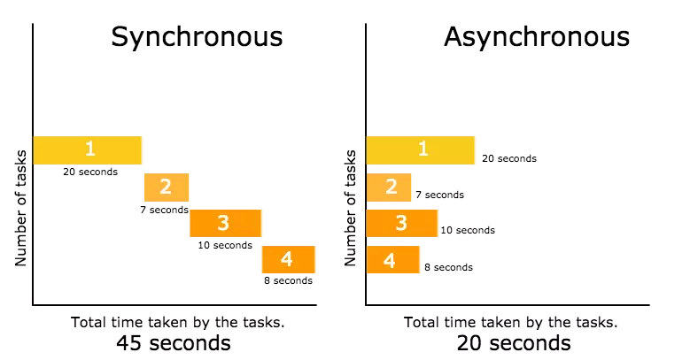
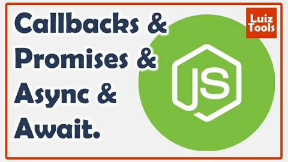

# JavaScript lecture 9

## Table of Contents
+ 01 ) Synchronous
+ 02 ) Asynchronous
+ 03 ) new Promise
+ 04 ) async/await
+ 05 ) try/catch
+ 06 ) fetch/request

# What is synch/async code in JavaScript ?
## Synchronous code 
> Synchronous means the code runs in a particular sequence of instructions given in the program. Each instruction waits for the previous instruction to complete its execution.

+ most code are synchtonous
- Synchronous code is executed line by line
* Each line of code waits for previous line to finish.

## Asynchronous code 
> Asynchronous programming provides opportunities for a program to continue running other code while waiting for a long-running task to complete. The timeconsuming task is executed in the background while the rest of the code continues to execute.

+ Asynchronous code is executed after a task that runs
- ts non-blocking
* Callback function alone do NOT make code asynchronous
+ Execution does not wait for an asynchronous task to finish its work

# create Asynchronous code
### Asynchronous code in JavaScript can be written using :
### + 1 ) Callbacks:
### + 2 ) Promise:
### + 3 ) async/await:

# try/catch
### The try...catch construct attempts to execute the statements in the try block, and if an error occurs, executes the catch block.

> try...catch works like this: code that might throw an error is placed in a try block. If an error occurs in the try block, the program goes to the catch block, where you can handle the error and take the necessary actions. However, the rest of the code continues to execute and your application won't break.

.webp)
# What is API/Rest API code in JavaScript ?
# API
> APIs are mechanisms that allow two software components to communicate with each other using a set of definitions and protocols. For example, a weather service software system contains daily weather data. API architecture is usually explained from a client and server perspective. The application sending the request is called the client, and the application sending the response is called the server. So, in the weather example, the service database is the server and the mobile app is the client.

.webp)

# Rest API
> Rest API APIs may vary. The most popular of them is REST. This will be discussed in this article. REST API (Representational State Transfer Application Programming Interface) is a set of rules and principles for creating web services that exchange data with each other. It is based on the REST architectural style, which defines how clients and servers should communicate with each other.

.webp)
# Fetch

+ Fetch is a function in modern JavaScript that is used to make HTTP requests to remote
resources such as APIs or servers. It provides a simple and convenient way to interact
with the network and receive data from the Internet.Using the fetch() function, you can
send network requests to the server - both receive and send data. The method returns a
promise with a response object, which contains additional information (response status,
headers) and the response to the request.

.webp)

# Fetch using Promise

# Fetch using async, get

# Fetch using async, Put (edit)

# Fetch using async, DELETE

.webp)